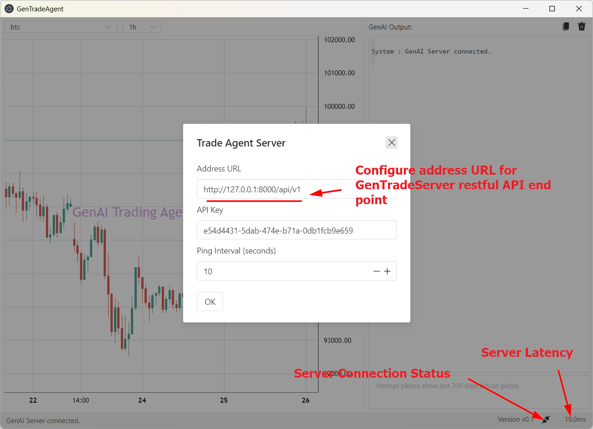

[](https://github.com/TrustWiseAgent/GenTradeServer/actions/workflows/doclint.yml)
[](https://github.com/TrustWiseAgent/GenTradeServer/actions/workflows/pylint.yml)

# GenTrade Server

## Quick Start

- Run from source

```shell
export PYTHONPATH=<repo_dir>/src
uvicorn gentrade-server.main:app --reload --host 0.0.0.0 --port 8000
or
python -m gentrade-server.main
```

- Run from docker

```shell
docker run -p 8000:8000 registry.cn-hangzhou.aliyuncs.com/kenplusplus/gentrade_server
```

After starting the server, please test restful API via <http://127.0.0.1:8000/docs>

## Setup Environment Variable

It dependends on following environment variable, please use `export` or create a
new `.env` file from [.env.template](./.env.template), and pass it into docker
via `--env-file`

```
OPENAI_API_KEY=
OPENAI_API_URL=
OPENAI_API_MODEL="gpt-3.5-turbo"

BINANCE_API_KEY=
BINANCE_API_SECRET=
GENTRADE_CACHE_DIR=/app/cache/

HTTP_PROXY=
HTTPS_PROXY=
NO_PROXY=127.0.0.1,localhost
```

## Configure from GenTradeAgent client

After server is established, please correct it in GenTradeAgent for new address
URL.


You can also get server's latency and connection status.